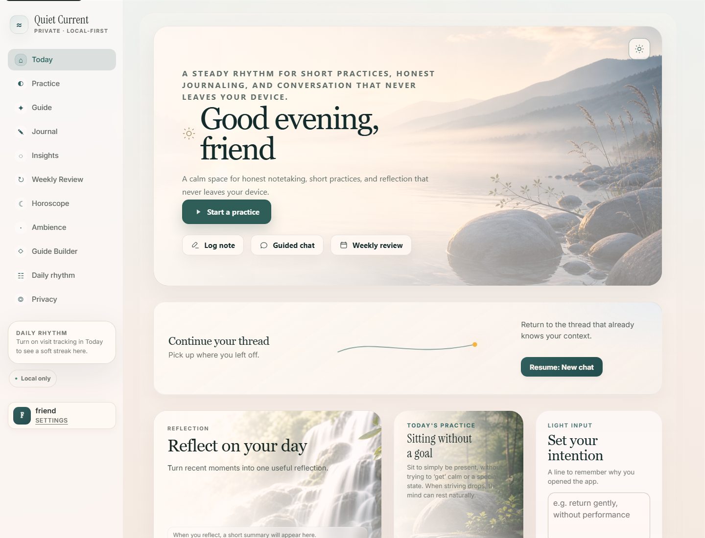
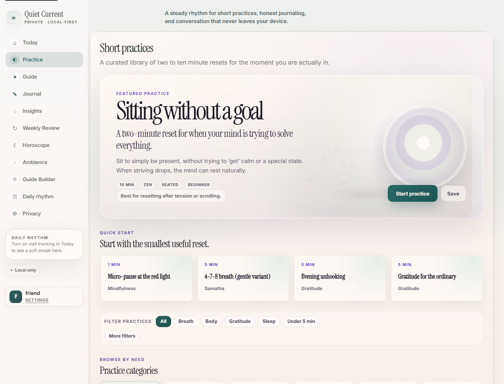
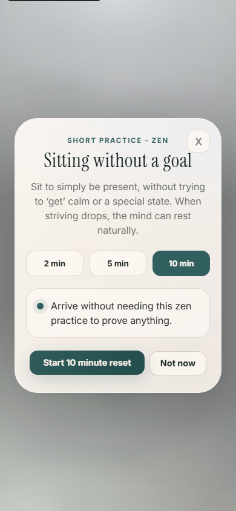
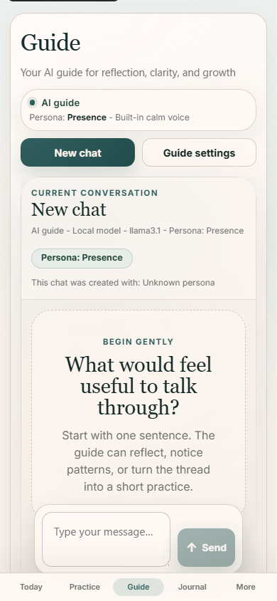
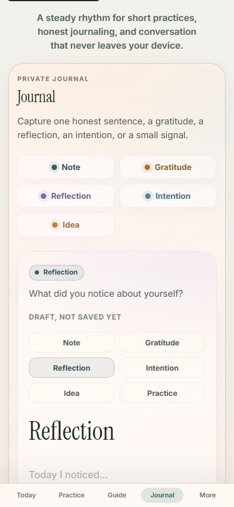
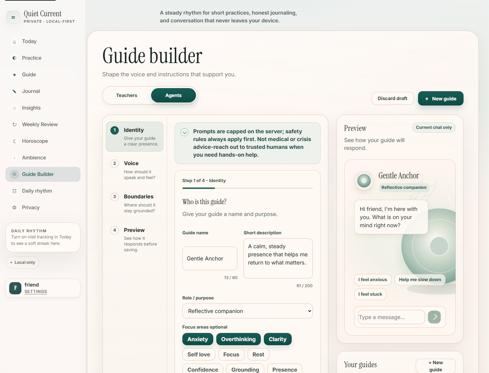
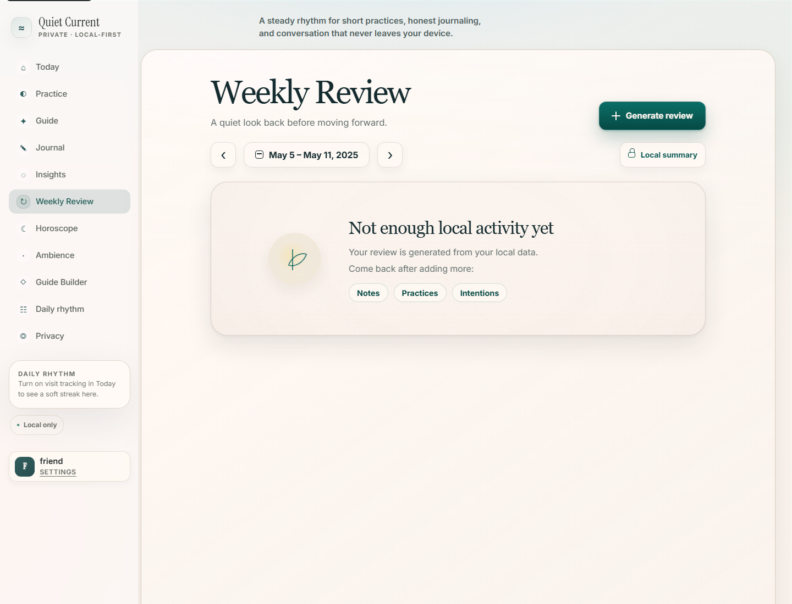
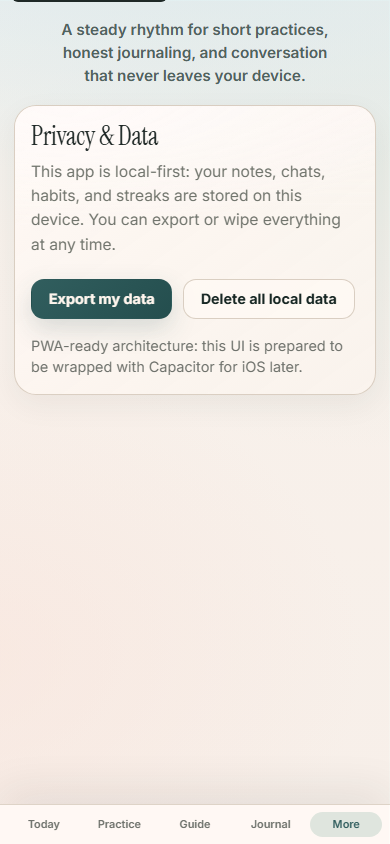

# Quiet Current — Agentic Reflection Platform

Quiet Current is a local-first mindfulness and reflection platform with agentic messaging, journaling, short practices, weekly reviews, and configurable AI guide personas. It is designed as a calm personal operating system for reflection: polished enough to feel like a premium consumer app, but implemented with a pragmatic full-stack architecture.

This repository is prepared as a portfolio project for product engineering, platform tooling, workflow automation, and AI-assisted delivery roles. It shows product thinking, frontend craft, local data handling, AI prompt orchestration, privacy-first defaults, and end-to-end app flows.

## Product Highlights

- Premium calm UI across Today, Practice, Guide, Journal, Guide Builder, and Weekly Review.
- Local-first data model backed by SQLite.
- Private AI guide with configurable personas and local Ollama support.
- Guided practice library with filtering, save states, and an immersive practice player.
- Journal with note types for general notes, gratitude, reflection, intention, and ideas.
- Weekly Review turns local activity into an editorial reflection artifact.
- Guide Builder supports custom agents with persona settings, behavior tuning, boundaries, and local persistence.
- Privacy controls for export and local data deletion.

## Engineering Highlights

- Built a full-stack React/TypeScript + Express product with SQLite persistence.
- Implemented agentic guide workflows with configurable personas, prompt composition, local context access, fallback behavior, and tests.
- Designed production-style quality gates with Vitest API/unit coverage and Playwright E2E flows.
- Created a premium responsive design system across desktop, tablet, and mobile surfaces.
- Preserved local-first privacy constraints while supporting optional model-provider configuration.

## Screenshots

| Today | Practice Hub |
| --- | --- |
|  |  |

| Practice Player | Guide |
| --- | --- |
|  |  |

| Journal | Guide Builder |
| --- | --- |
|  |  |

| Weekly Review | Profile & Preferences |
| --- | --- |
|  |  |

## Tech Stack

- React 18
- TypeScript
- Vite
- Express
- SQLite via `better-sqlite3`
- Vitest and Testing Library
- Playwright
- Ollama by default, with optional OpenAI-compatible provider configuration

## Architecture

Quiet Current is a full-stack local app:

- `src/` contains the React application and UI flows.
- `server/` contains the Express API, AI provider abstraction, SQLite storage, and tests.
- `public/` contains static assets, app icons, and texture assets used by the premium UI.
- `e2e/` contains Playwright flows.
- `docs/` contains design-system notes and portfolio screenshots.

The app defaults to local storage and local model execution. AI calls are routed through `server/aiProvider.js`, so the UI does not depend on a specific model provider.

## Run Locally

Prerequisites:

- Node.js 20+
- npm
- Optional: Ollama for local AI chat

Install and start:

```bash
npm install
cp .env.example .env
npm run dev
```

Open:

```text
http://127.0.0.1:5173
```

The development command starts both the Vite frontend and Express API.

## Optional Local AI Setup

Install Ollama from https://ollama.com, then pull a model:

```bash
ollama pull llama3.1
```

The default `.env.example` is configured for local Ollama. OpenAI-compatible APIs can be enabled through the documented environment variables.

## Verification

```bash
npm run build
npm run test:unit
npm run test:e2e
```

Notes:

- Unit and API tests use Vitest and Supertest.
- E2E tests use Playwright.
- Real AI chat requires a configured model provider, but tests are designed to avoid requiring a live Ollama model where possible.

## Why This Project Matters

Quiet Current demonstrates work that is directly relevant to senior product engineering and AI-assisted delivery roles:

- Turning ambiguous product direction into scoped, shippable UI.
- Building a consistent visual system without over-designing.
- Connecting frontend polish to actual state, persistence, and API behavior.
- Handling local-first privacy constraints.
- Designing AI UX with visible controls, boundaries, and fallback behavior.
- Maintaining responsive layouts across desktop, tablet, and mobile.

Suggested resume/project title:

```text
Quiet Current — Agentic Reflection Platform
```

## Repository Hygiene

This GitHub-ready copy intentionally excludes:

- `node_modules`
- build output
- installer artifacts
- local SQLite databases
- transient QA screenshots
- test-result folders
- logs
- generated zip packages

Use `.env.example` as the template for local configuration. Do not commit real `.env` files.

## Disclaimer

Quiet Current is a reflective journaling and mindfulness tool. It is not medical, psychiatric, legal, crisis, or emergency advice.
